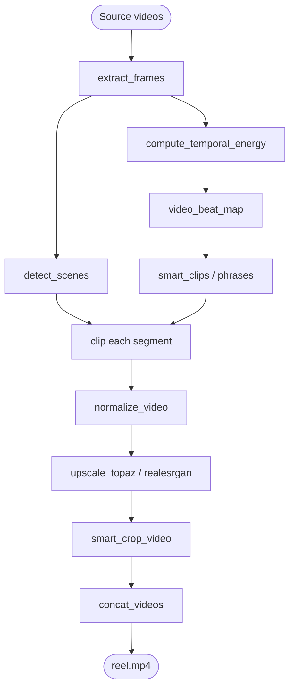

# Architecture

## Composable pipeline

videoflow is built around a single idea: **composable pipeline steps**.

Each step is a standalone Python function with well-defined inputs and outputs.
Steps connect via files or in-memory objects. The user assembles the workflow;
the library provides the steps.



Every long-running step writes a `job.json` to a shared folder. A monitor reads
the folder and shows a live progress table — no server, no SSH required.

## Relationship to media-tools

[media-tools](https://github.com/xolvco/media-tools) handles individual file operations:
probe, clip, extract audio, normalize, concat.

videoflow orchestrates those operations into multi-step, multi-machine workflows.
`extract_frames()`, `clip()`, `concat_videos()` are media-tools functions called by
videoflow steps — videoflow does not re-implement them.

## Wrap vs. build

When a mature open-source library already does the job well, we wrap it and surface the
result in our JSON/job-manifest format. When nothing equivalent exists, we build.

| Step | Strategy |
| --- | --- |
| Scene detection | Wrap PySceneDetect |
| Audio beat/BPM | Wrap librosa + madmom |
| Video beat map | Build — no equivalent exists |
| Smart clips | Build on PySceneDetect + beat map |
| Smart crop | Build — OpenCV as primitive |
| Job monitor | Build |
| Topaz script generation | Build — Topaz has no public wrapper |

## Job manifest

Every unit of work is a `job.json`:

```json
{
  "id": "clip1-upscale-4k",
  "operation": "upscale",
  "input": "/videos/clip1.mp4",
  "output": "/output/clip1_4k.mp4",
  "params": {"model": "proteus-v3", "target": "4k"},
  "status": "running",
  "progress_pct": 47,
  "machine": "DESKTOP-A",
  "started_at": "2026-03-20T09:14:00",
  "estimated_remaining_s": 4800
}
```

A `jobs/` folder (NAS, Dropbox, OneDrive) holds all job files.
Any machine can read them. The machine running a job updates `progress_pct`.
The monitor reads the folder and shows a live table.

## GPU context

Primary machines have NVIDIA RTX 4070 GPUs. Default encoder for scripts is
`hevc_nvenc`. Multiple machines run jobs simultaneously; `device=0`, `device=1`, etc.
select which GPU to use on multi-GPU machines. CPU fallback is always `libx265`.
