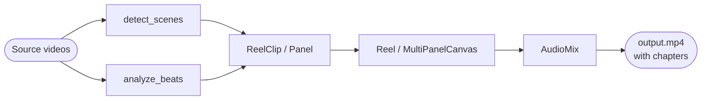

# videoflow

Composable video workflow pipeline for Python.

Concat videos with chapter markers, compose multi-panel canvases, analyse beats —
each step is a standalone function that connects into a workflow.

**FFmpeg required.** Install from [ffmpeg.org](https://ffmpeg.org).

## Install

```bash
pip install -e "."                     # core (ffmpeg provides the engine)
pip install -e ".[scenes]"             # + scene detection (PySceneDetect)
pip install -e ".[audio]"              # + beat analysis  (librosa)
pip install -e ".[scenes,audio,dev]"   # everything + dev tools
```

## Pipeline



## Features

- **Reel** — concat clips from a folder or list with black-frame gaps and embedded chapter markers ([guide](guide/reel.md))
- **Multi-panel canvas** — four portrait streams side by side on a wider-than-4K canvas, independent speeds, smart crop, finale reveal ([guide](guide/canvas.md))
- **Audio mixing** — multi-track audio with per-track levels, fade-in/out, linear volume ramps ([guide](guide/audio.md))
- **Beat analysis** — BPM, beat grid, downbeats, musical phrases, per-beat energy ([guide](guide/audio.md))
- **Scene detection** — PySceneDetect wrapper, adaptive/content/threshold detectors ([guide](guide/detect-scenes.md))

## Quick example

```python
from videoflow.reel import Reel

# Wire together every .mp4 in a folder — 2-second gaps, chapter markers
reel = Reel.from_folder("videos/", gap_ms=2000)
reel.render("output.mp4")
```

CLI:

```bash
videoflow concat --from-folder videos/ --output output.mp4
```

## JSON edit files

Every component serialises to a plain JSON file. Save a description, inspect and
edit it by hand, render it later — or automate the whole thing from a script.

```bash
videoflow concat  reel.json   --output reel.mp4
videoflow render  canvas.json --output canvas.mp4
```
